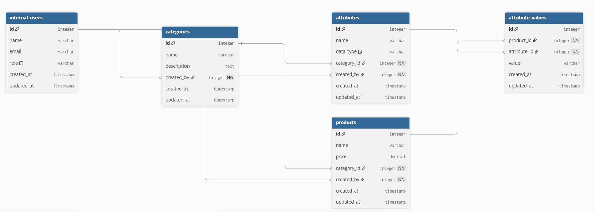
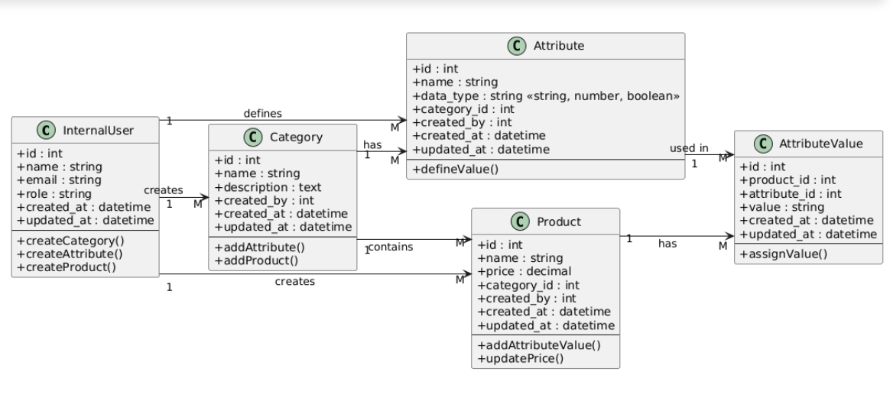

# Internal Product Management Tool

A web-based tool to manage products, categories, and internal user roles.

## Features
- Product and category management
- Assignment of products to categories
- Dashboard overview

## Technology
- **Backend:** Python / Flask  
- **Frontend:** HTML, CSS, JavaScript  
- **Database:** SQL  

## Diagrams

